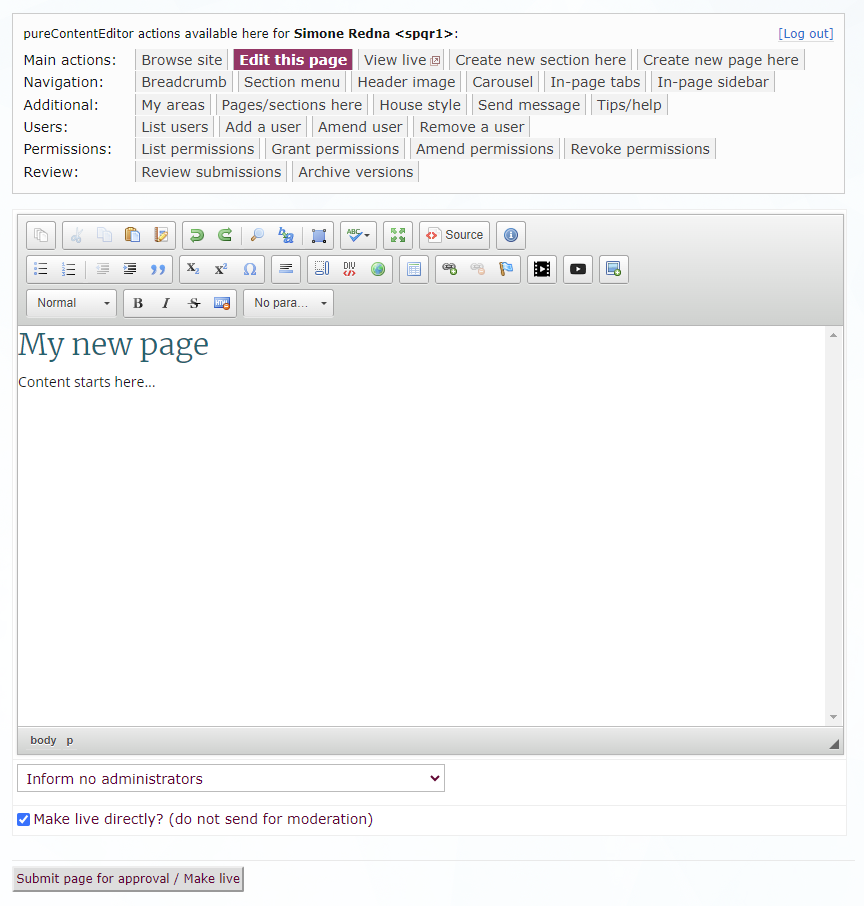

# pureContentEditor

This is a PHP application to add editing to a pureContent-enabled site.

## Screenshot

## Usage

1. Clone the repository.
2. Run `composer install` to install the dependencies.
3. Run `yarn install` to install the dependencies.
4. Download and install the famfamfam icon set in /images/icons/
5. Add the Apache directives in httpd.conf (and restart the webserver) as per the example given in .httpd.conf.extract.txt; the example assumes mod_macro but this can be easily removed.
6. Ensure port 8080 is enabled in your VirtualHost
7. Copy the example config file to /sitetech/purecontenteditor/.config.php on your site, and set the parameters
8. Access the page in a browser at a URL which is served by the webserver.

## Dependencies

* Composer
* Yarn

## Author

MLS, Department of Geography, University of Cambridge, 2005-24.

## License

GPL3.
